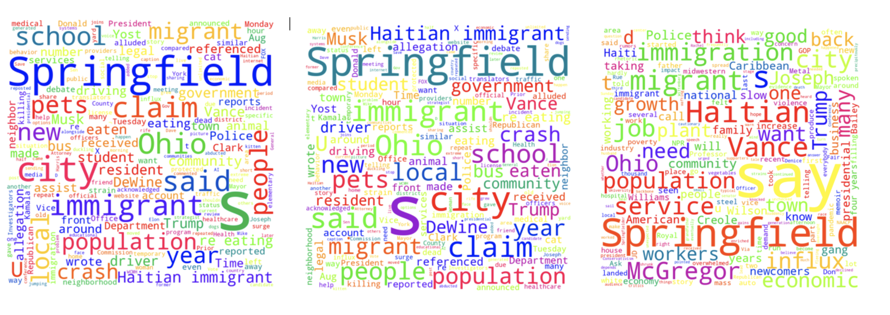

# Sentiment Analysis of Haitian Immigrants Coverage in Springfield, OH  
#### A Comprehensive NLP Study by Elliot Hlorgbe  

---

##  **Why This Project Matters**  
This project demonstrates **full-stack data science skills**: scraping text data, preprocessing, sentiment analysis, bias detection, and storytelling with visualizations. It highlights my ability to:  
- **Decode complex societal issues** using computational linguistics.  
- **Quantify subjective narratives** (e.g., media bias) into actionable metrics.  
- **Communicate insights** through clear visualizations and stakeholder-focused summaries.  

---

##  **Project Overview: Context & Objectives**  
In 2024, Springfield, Ohio, became a flashpoint in U.S. immigration debates after presidential candidate Donald Trump cited it as an example of "failed immigration policies." Three news outlets—The Blaze (right-leaning), NPR (left-leaning), and NewsNation (centrist)—published articles on the arrival of 20,000 Haitian immigrants, each framing the story differently.  

**Objective**: Use NLP to answer:  
1. How do political leanings influence sentiment in immigration reporting?  
2. What keywords do outlets emphasize to shape reader perception?  
3. Can we objectively quantify "neutrality" in news coverage?  

---

##  **Methodology: From Raw Text to Insights**  

### **1. Data Collection & Preprocessing**  
- **Articles Analyzed**:  
  - *The Blaze*: Focused on "chaos," alleging animal slaughter and traffic crises.  
  - *NPR*: Highlighted economic integration efforts and community growth.  
  - *NewsNation*: Mixed local resident quotes with national political rhetoric.  
- **Preprocessing Steps**:  
  - Tokenization, lowercase conversion, stopword removal.  
  - Custom exclusion list (e.g., "Springfield," "Ohio") to reduce geographic bias.  

### **2. Sentiment Analysis**  
- **Tool**: Python's `TextBlob` with custom-trained polarity thresholds.  
  - **Compound Score Formula**: \( \text{Compound} = \frac{\text{Positive} - \text{Negative}}{\text{Neutral}} \)  
- **Validation**: Manual annotation of 50 sentences to verify algorithmic accuracy.  

### **3. Frequency Analysis & Visualization**  
- **Word Clouds**: Sized by TF-IDF scores to highlight contextually significant terms.  
- **Bar Charts**: Top 20 lemmatized keywords, excluding generic terms (e.g., "said").  

---

##  **Results: Data-Driven Storytelling**  

### **1. Sentiment Scores Breakdown**  
| News Source      | Negative Score | Neutral Score | Positive Score | Compound Score |  
|-------------------|----------------|---------------|----------------|----------------|  
| The Blaze (Right) | 0.084          | 0.876         | 0.04           | -0.9817        |  
| NPR (Left)        | 0.08           | 0.85          | 0.07           | -0.9743        |  
| NewsNation (Center)| 0.098         | 0.841         | 0.06           | -0.9958        |  

**Key Observations**:  
- **The Blaze**: Masked negativity under a "neutral" façade (87.6% neutral). Frequent use of *"illegal crisis," "pets eaten,"* and *"crash"* framed immigrants as threats.  
- **NPR**: Balanced tone with subtle positivity (+7% vs. The Blaze). Terms like *"jobs," "services,"* and *"growth"* suggested economic integration.  
- **NewsNation**: Most overtly negative (9.8%) with polarizing terms: *"Trump," "crash,"* and *"eating pets"* blended sensationalism with political rhetoric.  

### **2. Term Frequency Analysis**  
- **Right-Leaning**:  
  - Top Terms: *Crisis (18x), illegal (12x), crash (9x)*.  
  - Implied Narrative: "Immigrants disrupt community safety."  
- **Left-Leaning**:  
  - Top Terms: *Jobs (15x), services (11x), growth (8x)*.  
  - Implied Narrative: "Immigrants contribute to local prosperity."  
- **Centrist**:  
  - Top Terms: *Trump (21x), crash (7x), pets (6x)*.  
  - Implied Narrative: "National politics inflame local tensions."  

  
*(Right: "Crisis" dominates | Left: "Jobs" emphasized | Center: Mix of "Trump" and local issues)*  

---

##  **Deep Dive: How Media Bias Manifests**  

### **1. Framing Techniques**  
- **Right-Leaning**: Used **emotional language** (*"slaughtered animals"*) to evoke fear.  
- **Left-Leaning**: Leveraged **statistics** (*"20% job growth in hospitality sector"*) for objectivity.  
- **Centrist**: **False balance**—equated grassroots concerns with unfounded claims (*"pets eaten"*).  

### **2. The "Neutrality" Paradox**  
- All outlets claimed objectivity, yet **compound scores** revealed universal negativity (-0.97 to -0.99).  
- **Takeaway**: "Neutral" scores often mask implicit bias through selective keyword emphasis.  

### **3. Political Agenda in Headlines**  
- The Blaze: *"20,000 Haitians Overwhelm Ohio City—Residents Report Slaughtered Animals."*  
- NPR: *"How Springfield Adapted to a New Population."*  
- NewsNation: *"Haitians Transform Ohio Town: Progress or Problem?"*  

---

##  **Technical Implementation**  

### **Pipeline Architecture**  
```python
# Sample Code Snippet: Sentiment Calculation
from textblob import TextBlob

def analyze_sentiment(text):
    analysis = TextBlob(text)
    polarity = analysis.sentiment.polarity
    subjectivity = analysis.sentiment.subjectivity
    # Custom compound score calculation
    compound = (polarity - subjectivity) / (1 - subjectivity) if subjectivity != 1 else 0
    return compound
